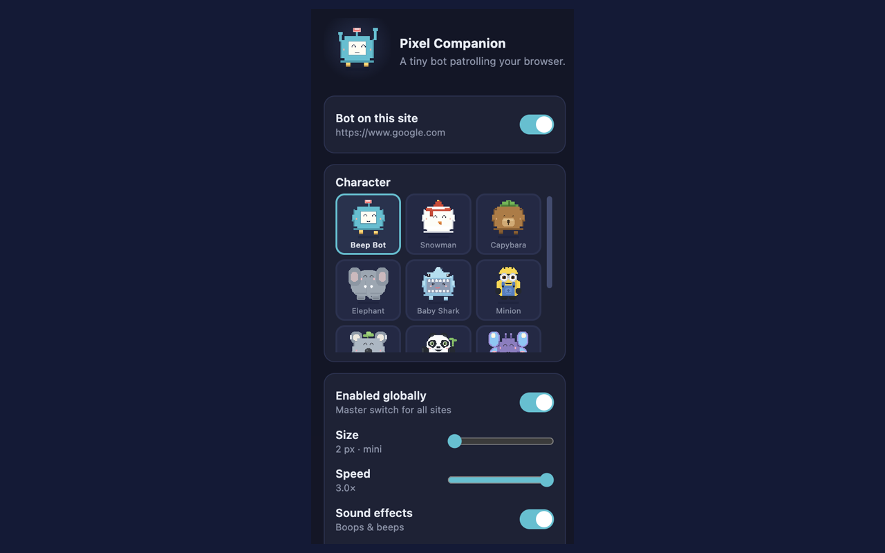
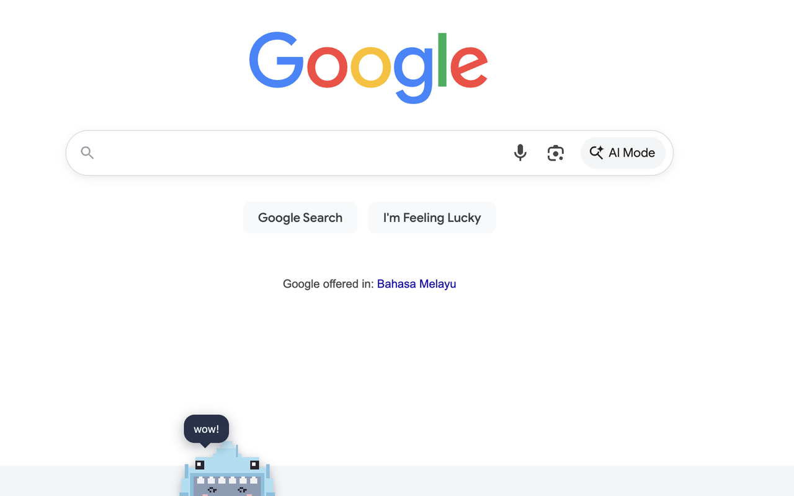
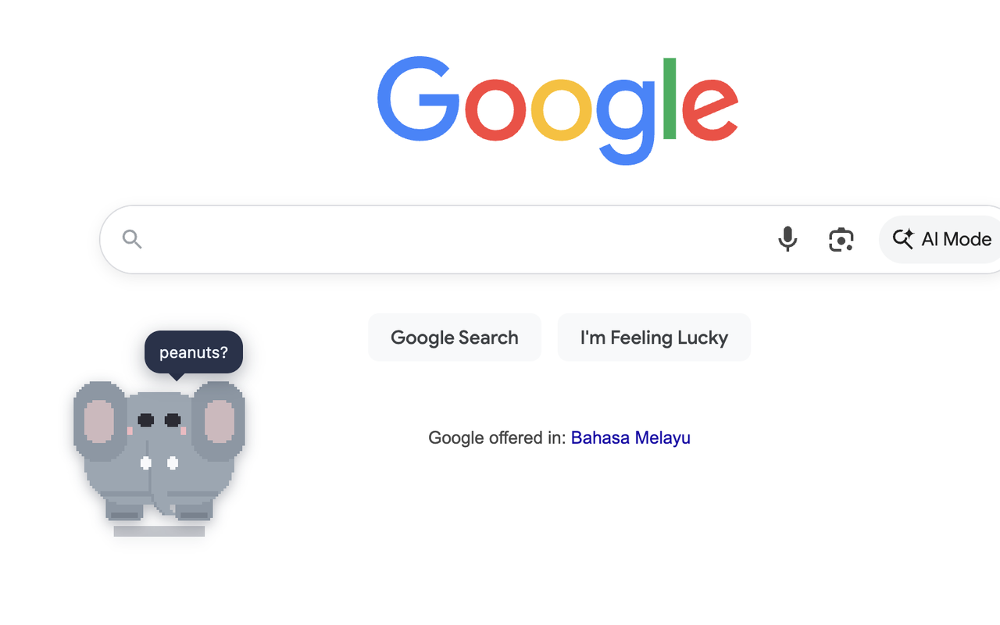

# Pixel Companion

A tiny chunky pixel pal that lives at the bottom of every web page. It walks,
idles, jumps when clicked, waves at your mouse, rides the scrollbar, drags
and pins, and talks in little speech bubbles — with **twelve characters** to
choose from.



## Characters

| | | |
|---|---|---|
| **Beep Bot** | **Snowman** | **Capybara** |
| **Elephant** | **Baby Shark** | **Minion** |
| **Koala** | **Panda** | **Butterfly** |
| **Aviator Pup** | **X-Buddy** | **Sunflower** |

<p align="center">
  
  
</p>

Each is drawn entirely in code (no image assets) and has its own speech
personality — the koala naps, the panda practices kung fu, the capybara is
unbothered, and X-Buddy just says "xx".

## Install

**From the Chrome Web Store (recommended once live):**

> Install: [Chrome Web Store — _link goes live after review_]

**From source (developer install):**

1. Clone or download this repo
2. Open **chrome://extensions** in Chrome
3. Enable **Developer mode** (top-right)
4. Click **Load unpacked** and select the `pixel-companion-extension/` folder

To allow the companion on `file://` pages, enable "Allow access to file URLs"
on the extension's Details page.

## Features

- Walks along the bottom of the viewport, flips at edges
- Idles, blinks, sits, and drops speech bubbles
- Jumps on click/tap with a synthesized boop
- Waves when the mouse is near; eyes follow the pointer
- Rides the scrollbar on long pages
- The panda breaks into kung fu on its own (punches, belly bounces, crane)
- Press and hold to grab & drag; drop away from the floor to pin it mid-air
- All sound effects are synthesized with the Web Audio API — no audio files

### Popup settings

- Character picker with live previews
- Per-site on/off + global master toggle
- Size 2–10 px, speed 0.4×–3×
- Separate sound / speech toggles

Settings save to `chrome.storage.local` and apply live in every tab.

## Privacy

No data collection. No analytics, no accounts, no tracking, no servers.
Works 100% offline after install. Permissions are limited to:

- **storage** — saves your settings on your own device
- **activeTab** — lets the per-site toggle know the current site

Content scripts never run on `chrome://` pages or the Chrome Web Store.

## Support

Found a bug or have a character idea? [Open an issue](https://github.com/Limpohal/pixel-companion-extension/issues).

## Development

```
node test/render-headless.js       # renders all skins, guards renderer drift
node test/interaction-headless.js  # pointer layer: hit testing, drag, pin
node tools/ascii_preview.js        # render skins as ASCII in a terminal
python3 tools/gen_icons.py         # regenerate extension icons
python3 tools/gen_cws_assets.py    # regenerate store assets (assets/)
```

## License

MIT
